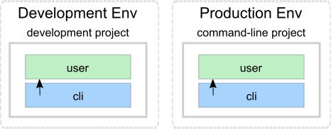
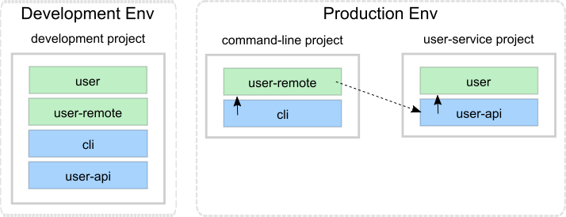
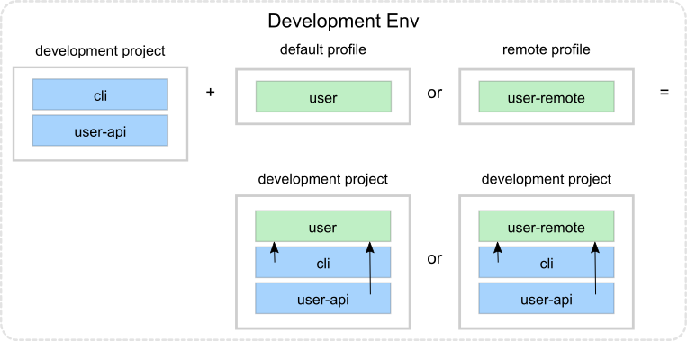
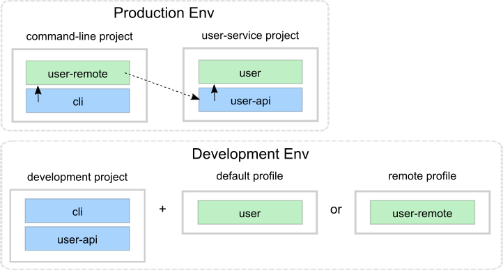

= Profile
:toc:

In production, deployable projects, by their nature, run in separate processes.
In development, you are running from a single REPL process
This can lead to classpath issues you would never encounter in production.
Profiles allow you to work on all your projects from the `development` project without issue.

In our ongoing xref:introduction.adoc[tutorial], we last left off exploring xref:testing.adoc[testing].

== A Hypothetical Problem

Your `development` project currently mirrors the `command-line` project:

The `cli` base references the `user` component in both projects.
Let's pretend that we have discovered performance problems in the `user` component and that we have learned that distributing the load, by delegating to a new service, should solve the problem:

The `cli` base now references a new `user-remote`, which calls a new `user-api` base in a new `user-service` project, which references our original `user` component.

The production environment looks good, but how about the `development` environment?
We have a problem.
Both `user` and `user-remote` components share the same `user` interface, resulting in two `se.example.user` namespaces on the classpath.
Duplicate items on the classpath will confuse classloaders and IDEs.

NOTE: We don't have classloader issues in production because `command-line` and `user-remote` projects run in separate processes.

== Profiles to the Rescue

The `poly` solution is to use profiles:

We've added a `remote` profile to avoid duplication on the classpath, which allows us to develop all our code and projects from a single place without issues.

If no other profiles are selected, `poly` automatically merges the `default` profile into the `development` project.

****
The name `default` is set by `:default-profile-name` in xref:workspace.adoc#workspace-edn[workspace.edn] and can be changed, but we'll leave it as it is.
****

== Designing a Solution

Let's move from our current design:

...to our new one:

== Implementation

First, we need to decide how the `command-line` tool will communicate with `user-service` over the wire.
After some searching, we found the https://github.com/sunng87/slacker[slacker] library that allows us to use https://en.wikipedia.org/wiki/Remote_procedure_call[remote procedure calls] in a simple way.
Perfect for our tutorial.

Let's create a checklist to implement our design:

<<create-user-api-base>> +
<<create-user-remote-component>> +
<<adjust-command-line-project>> +
<<create-user-service-project>> +
<<build-user-service>>

Let's go through the list.

[[create-user-api-base]]
=== 1. Create the `user-api` base

* Create the `user-api` xref:base.adoc[base].
* Add the `slacker` library to the base.
* Add the base to `./deps.edn`.
* Implement the server for `user-api`:

Create the `user-api` base:

[source,clojure]
----
poly create base name:user-api
----

Add the `slacker` library to `bases/user-api/deps.edn`:

[source,clojure]
----
 :deps {slacker/slacker {:mvn/version "0.17.0"}}
----

Add `user-api` to `./deps.edn`:

[source,clojure]
----
 :aliases  {:dev {:extra-deps [...
                               poly/user-api {:local/root "bases/user-api"}
                               ...]

            :test {:extra-paths [...
                                 "bases/user-api/test"
----

Create the `api` namespace:

[source,shell]
----
example
├── bases
│   └── user-api
│       └── src
│           ├── se.example.user_api.api.clj
│           └── se.example.user_api.core.clj
----

...with this content for the `api`:

./bases/user-api/se/example/user_api/api.clj
// scripts/sections/profile/user-api-api.clj
[source,clojure]
----
(ns se.example.user-api.api
  (:require [se.example.user.interface :as user]))

(defn hello-remote [name]
  (user/hello (str name " - from the server")))
----

...and update the `core` namespace:

./bases/user-api/se/example/user_api/core.clj
// scripts/sections/profile/user-api-core.clj
[source,clojure]
----
(ns se.example.user-api.core
  (:require [se.example.user-api.api]
            [slacker.server :as server])
  (:gen-class))

(defn -main [& args]
  (server/start-slacker-server [(the-ns 'se.example.user-api.api)] 2104)
  (println "server started: http://127.0.0.1:2104"))
----

[[create-user-remote-component]]
=== 2. Create the `user-remote` component

- Create the component.
- Add the `slacker` library to the component.
- Remove `user from `./deps.edn`.
- Create the `default` and `remote` profiles.
- Activate the `remote` profile in the IDE.
- Activate the `default` profile in the REPL configuration.
- Implement the component.

Create the `user-remote` component:

[source,shell]
----
poly create component name:user-remote interface:user
----

Add the `slacker` library to `components/user-remote/deps.edn`:

[source,clojure]
----
 ...
 :deps {slacker/slacker {:mvn/version "0.17.0"}}
----

Remove the `user` component from `./deps.edn`:

[source,clojure]
----
{:aliases  {:dev {...
                  :extra-deps {poly/cli  {:local/root "bases/cli"}
                               poly/user-api {:local/root "bases/user-api"}

                               org.clojure/clojure {:mvn/version "1.11.1"}}}

            :test {:extra-paths ["bases/cli/test"
                                 "bases/user-api/test"]}
----

Add the `default` and `remote` profiles to `./deps.edn`:

[source,clojure]
----
:aliases  {...

           :+default {:extra-deps {poly/user {:local/root "components/user"}}
                      :extra-paths ["components/user/test"]}

           :+remote {:extra-deps {poly/user-remote {:local/root "components/user-remote"}}
                     :extra-paths ["components/user-remote/test"]}
----

[TIP]
====
*Cursive users*: Activate the `remote` profile in your IDE:

====

Create the `core` namespace:

[source,shell]
----
example
├── components
│   └── user-remote
│       └── src
│           ├── se.example.user.core.clj
│           └── se.example.user.interface.clj
----

...with this content:

./components/user-remote/src/se/example/user/core.clj
// scripts/sections/profile/user-remote-core.clj
[source,clojure]
----
(ns se.example.user.core
  (:require [slacker.client :as client]))

(declare hello-remote)

(defn hello [name]
  (let [connection (client/slackerc "localhost:2104")
        _ (client/defn-remote connection se.example.user-api.api/hello-remote)]
    (hello-remote name)))
----

...and update the `interface` namespace:

./components/user-remote/src/se/example/user/interface.clj
// scripts/sections/profile/user-remote-interface.clj
[source,clojure]
----
(ns se.example.user.interface
  (:require [se.example.user.core :as core]))

(defn hello [name]
  (core/hello name))
----

[TIP]
====
*Cursive users*: Edit the REPL configuration:

...and add the `default` profile to Options: `-A:dev:test:build:+default`
====

[NOTE]
====
*Cursiver users*: In the beginning we added `-A:dev:test` when we configured the REPL.
Alternatively we could have added `-A:dev:test:build:+default`; this is a good idea because now we don't have to remember to add the aliases later.
Any unused aliases are ignored by tools.deps.
====

// TODO: review and reword
The reason we have to do this, is because we removed the `user` component from `./deps.edn` and now we have to add it via a profile instead.
We need access to the source code for the `se.example.user.interface` namespace, and we have two alternatives, the `user` or the `user-remote` component that both use this interface.
The `user` component is a better default because it's simpler and only communicates via direct function calls without hitting the wire.

For the changes to take effect, you need to restart the REPL.
Normally, a REPL restart is not required, but when adding profiles, it's necessary.

[[adjust-command-line-project]]
=== 3. Switch from user to `user-remote` in `deps.edn` for the `command-line` project

- Replace `user` with `user-remote` for the `command-line` project.
- Add the `log4j` library to `deps.edn` for `command-line`.
- Create a command-line uberjar.

Update the configuration file for the `command-line` project:

[source,shell]
----
example
├── projects
│   └── command-line
│       └── deps.edn
----

Replace `user` with `user-remote`, and add the `log4j` library (to get rid of warnings) in `projects/command-line/deps.edn` (it's okay to keep the interface name `poly/user`, because it's unique within the project):

./projects/command-line/deps.edn
[source,clojure]
----
{:deps {poly/user {:local/root "../../components/user-remote"}
        ...

        org.apache.logging.log4j/log4j-core {:mvn/version "2.13.3"}
        org.apache.logging.log4j/log4j-slf4j-impl {:mvn/version "2.13.3"}}
----

Create an uberjar for the `command-line` project by executing:

[source,shell]
----
clojure -A:deps -T:build uberjar :project command-line
----

[[create-user-service-project]]
=== 4. Create the `user-service` project

* Create the project.
* Update its `deps.edn`:
** Add dependency to the `user` component.
** Add dependency to the `user-api` base.
** Add the uberjar alias.
* Add the `cl` alias for the `user-service` in `workspace.edn`.

Create the `user-service` project:

[source,shell]
----
poly create project name:user-service
----

Set the content of `projects/user-service/deps.edn` to this:

// scripts/sections/profile/user-service-deps.edn
[source,clojure]
----
{:deps {poly/user {:local/root "../../components/user"}
        poly/user-api {:local/root "../../bases/user-api"}

        org.clojure/clojure {:mvn/version "1.11.1"}
        org.apache.logging.log4j/log4j-core {:mvn/version "2.13.3"}
        org.apache.logging.log4j/log4j-slf4j-impl {:mvn/version "2.13.3"}}

 :aliases {:test {:extra-paths []
                  :extra-deps  {}}

           :uberjar {:main se.example.user-api.core}}}
----

Add the `user-s` alias for the `user-service` in `workspace.edn`:

[source,clojure]
----
 :projects {"development" {:alias "dev"}
            "command-line" {:alias "cl"}
            "user-service" {:alias "user-s"}}}
----

[[build-user-service]]
=== 5. Build the `user-service`

Create an uberjar for the `user-service`:

[source,shell]
----
clojure -A:deps -T:build uberjar :project user-service
----

== Let's test

Phew, that should be it!
Now, let's test if it works.

Execute this from the workspace root in a separate terminal:

[source,shell]
----
cd projects/user-service/target
java -jar user-service.jar
----

Now that you have a running service, you can test if you can call it from the REPL.
You activated the remote profile in our IDE earlier, which made the `user-remote` component active.

Note that this only instructs the IDE to treat `user-remote` as source code:

...but it *doesn't* load its source code into the REPL!

You can verify this by adding this code to `development/src/dev/lisa.clj`:

[source,clojure]
----
(ns dev.lisa
  (:require [se.example.user.interface :as user]))

(user/hello "Lisa")
----

...and if you execute the `hello` function, we still get:

[source,clojure]
----
"Hello Lisa!!"
----

Remember that you set the REPL configuration to `-A:test:dev:build:+default` which loads the `user` component into the REPL every time you start or restart the REPL.
This is the recommended way of configuring the default REPL, by selecting the "simple" components that communicate with each other using direct function calls.
Because of this, you should keep the `-A:test:dev:build:+default` configuration as it is.

Let's create a REPL that includes the remote profile:

This REPL will use the `user-remote` component and can be used to emulate a production-like environment.

But let's continue with the REPL that is already running and see if we can switch to `user-remote` without restarting it.

Open the `core` namespace of the `user-remote` component and select `Tools > REPL > Load file in REPL`.
This will replace the `user` implementation with the `user-remote` component, which works because both live in the same `se.example.user` namespace, which is also their interface (`user`).

If we execute the `hello` function again from `dev.lisa`, we should get:

[source,text]
----
Hello Lisa - from the server!!
----

Now, let's continue with our example.
Execute this from the other terminal (the one that we didn't start the server from):

[source,text]
----
cd ../../command-line/target
java -jar command-line.jar Lisa
----

[source,text]
----
Hello Lisa - from the server!!
----

Wow, that worked too! The complete tutorial code can be found
https://github.com/polyfy/polylith/tree/master/examples/doc-example[here].

Now execute the xref:commands.adoc#info[info] command (`+` deactivates all profiles, and makes the `default` profile visible):

[source,text]
----
cd ../../..
poly info +
----

...and compare it with the target design:

[cols="2",frame="none",grid="none"]
|===
a|image::images/profile/output/info-all-aliases.png[]
a|image::images/profile/target-design.png[]
|===

Looks like we got everything right!

Notice the `st` flags for the `default` and `remote` profiles.
Notice the `x` flag is omitted.
// TODO: Explain why

This example was quite simple, but if our project is more complicated, we may want to manage state during development with a tool like https://github.com/tolitius/mount[Mount], https://github.com/stuartsierra/component[Component], or https://github.com/weavejester/integrant[Integrant], or we could create our own helper functions that we put in the `dev.lisa` namespace, which can help us switch profiles by using a library like https://github.com/clojure/tools.namespace[tools.namespace].

If we want to switch profile when running a command, we need to pass them in, e.g.:

[source,text]
----
poly info +remote
----

Now the `remote` profile is included in the `development` project and listed after `active profiles`.

It's possible to give more than one profile:

[source,text]
----
poly info +default +remote
----

image::images/profile/output/info-multiple-profiles.png[width=500]

The tool complains and doesn't like that we just included both `user` and `user-remote` in the `development` project!

The profiles can also contain libraries and paths to projects, but right now we have no such paths and therefore all profiles are marked with `--` in the project section.

Now when we are finished with our example system, it could be interesting to see how many lines of code each brick and project consists of.
This can be done by passing in `:loc`:

[source,text]
----
poly info :loc
----

Each project summarises the number of lines of code for each brick it contains.
The `loc` column counts the number of lines of codes under the `src` directory, while `(t)` counts for the test directory.

Our projects are still quite small, but they will eventually reach 1000 lines of code, and when that happens we may want to change the thousand delimiter in `~/.polylith/config.edn` which is set to `,` by default.

Let's run all the tests to see if everything works:

[source,text]
----
poly test :project
----

// only info command supports export to png at this time, so this output needs to be update manually as necessary

It worked!
