= Shell
:poly-version: 0.2.18

The `shell` makes you more productive and is fun!
It uses https://github.com/jline/jline3[jline3] under the hood, which supports:
macOS, Linux, FreeBSD, Solaris, and Windows.

Let's explore some shell features.

[[launch]]
== Launching

Start a shell by typing `poly` from your workspace root (xref:component.adoc#shell-is-default[shell is the default command]):

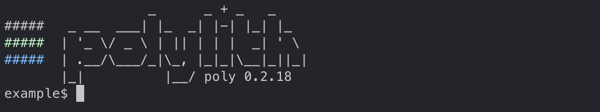

Notice that the `example$` prompt includes your workspace name.
From here, you can run commands and get instant feedback.

[[quit]]
== Quitting

To quit the shell, type `exit` or `quit` or press either of:

* kbd:[Ctrl+C]
* kbd:[Cltrl+D] (if not on Windows)

== Let's Play

xref:#launch[Launch a poly shell] and play along.

Press kbd:[Tab] to see all available commands:

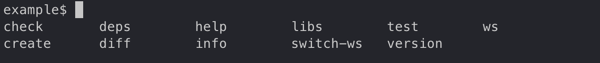

Type `i` to match all commands starting with the letter `i`:

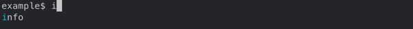

Press kbd:[Tab] to autocomplete the xref:commands.adoc#info[info] command and lists valid arguments:

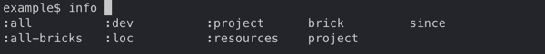

Many arguments start with the colon character, but you typically do not have to type it.
For example, type `l` to match `:loc`.

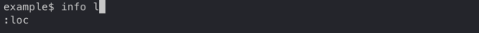

Press kbd:[Tab] to autocomplete `:loc`:

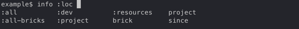

To distinguish `:project` from `project`, type the leading `:` (colon character):

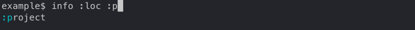

Complete `:project` by pressing kbd:[Tab].
Type `p` then press kbd:[Tab] to autocomplete `project:`, and kbd:[Tab] again, to list all projects in the workspace:

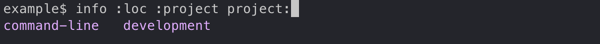

When you have only one candidate, select it by pressing kbd:[Tab]:

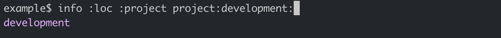

The trailing `:` (colon character) indicates a multi-select argument (you can select more than one project).
You can leave the multi-select input mode by pressing kbd:[Space]; this removes the trailing colon:

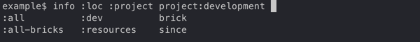

An alternative way of selecting a listed candidate is to press kbd:[Tab] twice and use the arrow keys to move the selection cursor around:

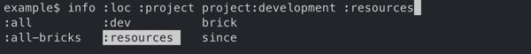

Press kbd:[Enter] to choose the item at the cursor:

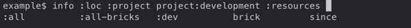

== The Dash Item

The `brick` parameter shows you all available bricks.
Selecting the `-` (the dash character) tells `poly` you want no bricks selected:

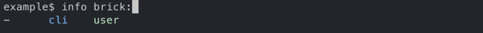

== Using Autocomplete to Explore

Autocomplete really shines when there are many available suggestions.
The xref:commands.adoc#ws[ws] command offers a good example.
Instead of trying to remember all the different `get:` arguments, the `shell` lists them for you:

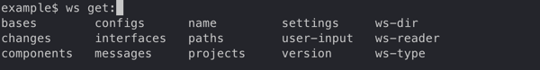

After you select `components` the `shell` lists valid arguments.
Sometimes, you encounter multiple matching suggestions.
When one of them is an exact match for what you have typed:

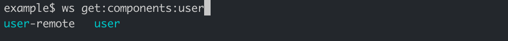

You can select it by typing `:` (the colon character):

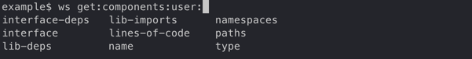

You can continue navigating down into the workspace structure to find the information you are interested in:

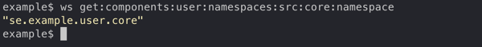

== Switching Workspace

When you start a `shell` from a workspace root directory (where the `workspace.edn` file lives), that workspace is automatically loaded, and you can execute all available commands against that workspace.

You can switch to a different workspace without leaving the poly shell, but the xref:commands.adoc#create[create] and xref:commands.adoc#test[test] commands will not work.

****
If you want to play along, exit the shell, then clone https://github.com/furkan3ayraktar/clojure-polylith-realworld-example-app[clojure-polylith-realworld-example-app] under the same parent directory as your `example` workspace:

[source,shell]
----
cd ..
git clone https://github.com/furkan3ayraktar/clojure-polylith-realworld-example-app.git
----
And relaunch the poly shell:
[source,shell]
----
cd example
poly
----
****

You can switch to another workspace using the xref:commands.adoc#switch-ws[switch-ws] command in combination with its `dir` argument:

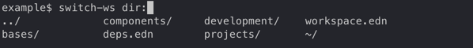

The `shell` lists all directories and `.edn` files under the current directory.

Select the `clojure-polylith-realworld-example-app` directory by typing `.` followed by kbd:[Tab] to select `..` and then type `clo` (or something long enough) followed by kbd:[Tab] to select the workspace directory:

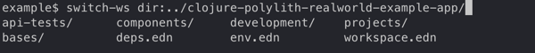

Switch workspace by pressing kbd:[Enter]:

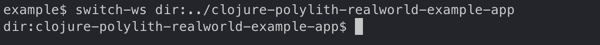

Notice the prompt has changed to show the currently selected workspace (by dir).
All commands will be run against this selected workspace.

You can go back to the `example` workspace by invoking `switch-ws` without arguments:

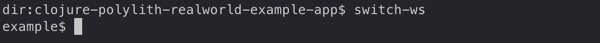

=== Switching to an Exported Workspace

You can switch to an exported workspace.

NOTE: You can export as workspace to a `.edn` file, e.g. via `poly ws out:ws.edn`.

****
If you want to play along, exit the shell, then clone the `polylith` branch of https://github.com/seancorfield/usermanager-example/tree/polylith[usermanager-example] project under the same parent directory as your `example` workspace.

[source,shell]
----
cd ..
git clone --branch polylith https://github.com/seancorfield/usermanager-example.git
cd usermanager-example
poly ws out:ws.edn
----

And relaunch the poly shell:
----
cd ../example
poly
----
****

Switch to the exported workspace using the `file` argument.

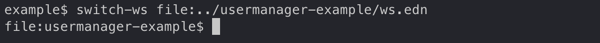

Notice that the prompt has changed to show the currently selected workspace (by export file).

=== Launch a Shell in a Specific Workspace

You can launch a shell and immediately switch to a workspace:

[source,text,subs="+attributes"]
----
$ poly ws-dir:examples/doc-example
                  _      _ + _   _
#####   _ __  ___| |_  _| |-| |_| |_
#####  | '_ \/ _ \ | || | | |  _| ' \
#####  | .__/\___/_|\_, |_|_|\__|_||_|
       |_|          |__/ poly {poly-version}
dir:doc-example$
----

...or read a workspace from an export file, e.g.:

[source,text,subs="+attributes"]
----
$ poly ws-file:realworld.edn
                  _      _ + _   _
#####   _ __  ___| |_  _| |-| |_| |_
#####  | '_ \/ _ \ | || | | |  _| ' \
#####  | .__/\___/_|\_, |_|_|\__|_||_|
       |_|          |__/ poly  {poly-version}
file:clojure-polylith-realworld-example-app$
----

== Autocomplete

The autocomplete helps you execute different commands with the correct arguments:

* Available sub-commands are suggested for a command:
+
[source,text]
----
example$ create
base        component   project
----
* Available arguments are suggested for the current command:
+
[source,text]
----
example$ test
:all          :all-bricks   :dev          :loc          :project      :verbose      brick         project       since
----
* Browse your file system when selecting files and directories:
+
[source,text]
----
example$ switch-ws dir:
../             bases/          components/     deps.edn        development/    projects/       workspace.edn   ~/
----
* Browse your workspace structure via the xref:commands.adoc#ws[ws] command:
+
[source,text]
----
example$ ws get:interfaces:user:
definitions               implementing-components   name                      type
----
* Browse documentation the xref:commands.adoc#doc[doc] command:
+
[source,text]
----
example$ doc help:
check                create-project       deps-brick           deps-workspace       doc                  migrate              switch-ws            version
create-base          create-workspace     deps-project-brick   deps                 info                 overview             tap                  ws
create-component     create               deps-project         diff                 libs                 shell                test
----
* Tag patterns defined in `workspace.edn` are suggested when using the `since:X` parameter:
+
[source,text]
----
??
----
* Remote git branches are suggested when using the `branch:X` parameter.
+
[source,text]
----
??
----
* Relevant bricks and projects are suggested when using the `brick:X` and `project:X` parameters:
** If a `project:X` parameter is selected from the xref:commands.adoc#info[info] or xref:commands.adoc#test[test] command,
only projects that are marked for testing will be suggested (we don't need to select already filtered out projects).
** If a brick has been selected from the xref:commands.adoc#deps[deps] command, only projects that contain that brick will be suggested.
** If a project has been selected from the xref:commands.adoc#deps[deps] command, only bricks from that project will be suggested.

When browsing the file system from a `dir:PATH` parameter, there are a couple of things worth mentioning:

* If we want to go to the user home directory we have to type `~/` and not just `~` (this is a problem with the underlying https://github.com/jline/jline3[jline3] integration).
* When a file or directory contains spaces, it will be surrounded with quotes, e.g. "My path".
To select such a path we need to include the first " in the path for the autocomplete to work.

=== Create Workspace

You'll typically run xref:commands#create-workspace[create workspace] from your terminal shell (bash, PowerShell, zsh, etc) and then use the poly shell on that workspace.

The poly shell will not suggest `workspace` for the xref:commands.adoc#create[create] when it is associated with a workspace.

You will get' workspace' suggestions if you run the poly shell outside any workspace:

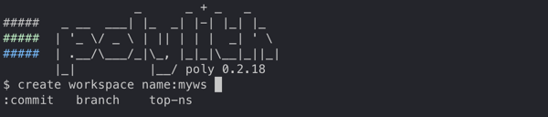

