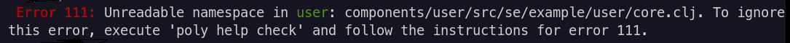

= Validations
:toc:

Each time you execute the xref:commands.adoc#check[check], xref:commands.adoc#info[info], or xref:commands.adoc#test[test] command, your workspace is validated.

For a list of validations, see the xref:commands.adoc#check[check] command.
You can show the same help at your terminal via:

[source,shell]
----
poly help check
----

The xref:commands.adoc#check[check] command returns a non-zero exit code on errors only (not warnings).
See xref:commands.adoc#check[check] for details.

The xref:commands.adoc#test[test] command fails fast on any xref:commands.adoc#check[check] errors.
Warnings do not affect test outcome.

The xref:commands.adoc#info[info] command shows errors and warnings, but they do not affect its exit code.

TIP: By default, xref:commands.adoc#check[check] only runs against projects under the `projects` directory.
Specify the `:dev` argument, and `poly` will also check your `development` project.

== Viewing All Errors and Warnings

All errors and warnings are stored in the workspace structure; you can list them via the xref:commands.adoc#ws[ws] command:

[source,shell]
----
poly ws get:messages
----

An example output:

image::images/validations/messages-example.png[width=600]

If your workspace doesn't have any active warnings or errors, you will see an empty result:

[source,shell]
----
[]
----

[#warning207]
== Marking a Brick as Necessary to Suppress Warning 207

The xref:commands.adoc#check[check] command generates a `Warning 207 - Unnecessary components were found in project` when it finds components unused by any bricks in a project.

Suppose you get warning 207 for a project but know the component is needed (e.g., it is used dynamically but not explicitly called).
In that case, you can suppress the warning by specifying that it is `:necessary` to the project in your `workspace.edn`:

[source,clojure]
----
{...
 :projects {"poly" {:alias "poly"
                    :necessary ["api" "clojure-test-test-runner"] ;; <1>
                    :test {:setup-fn project.poly.hto/activate!}}
            "polyx" {:alias "polyx" :test [] :necessary ["clojure-test-test-runner"]} ;; <1>
            "development" {:alias "dev"}}
...}
----
<1> Example usages from the `poly` tool link:https://github.com/polyfy/polylith/blob/969d3beea27e754fcaccbf52631449774a4d7e7c/workspace.edn#L9-L13[itself]

[#error111]
== Ignoring Files in Bricks and Projects to Suppress Error 111

If `poly` finds that a `.clj` or `.cljc` source file is unreadable or its namespace is missing, you will see `Error 111: Unreadable namespace`.

Let's explore this error with our `example` xref:introduction.adoc[tutorial] workspace.
The `example` workspace source is link:/examples/doc-example[here] if you have not been following along.

NOTE: If you follow along, remember to revert your changes to your `example` workspace afterward.

[#error111-bricks]
=== Suppressing for a Brick

Comment out the `se.example.user.core` namespace declaration in the `user` component:

../components/user/src/se/example/user/core.clj
[source,clojure]
----
;(ns se.example.user.core) ;; <1>

(defn hello [name]
  (str "Hello " name "!!"))
----
<1> Comment this line out

Run:
[source,shell]
----
poly check
----
You should see this error:

Have a look at the namespace with the xref:commands.adoc#ws[ws] command:

[source,shell]
----
poly ws get:components:user:namespaces:src:core
----

Notice that `poly` has marked it as invalid:

[source,clojure]
----
{:file-path "components/user/src/se/example/user/core.clj",
 :imports [],
 :is-invalid true, ;; <1>
 :name "core",
 :namespace ""}
----
<1> Marked as invalid

To suppress this error, add the filename to `:ignore-files` in the `user` component in your `workspace.edn`:

[source,clojure]
----
{ ...
 :bricks {"user" {:ignore-files ["core.clj"]}} ;; <1>
  ...
}
----
<1> Tell `poly` to ignore any occurrences of invalid files named `core.clj` or with paths that end with `/core.clj` in the `user` brick.

[TIP]
====
`:ignore-files` matching rules:

* for each given file `f`, matches all paths ending with `/f`
* any `-` (dash characters) are automatically converted to `_` (underscore characters), allowing you to mimic namespace names in your config but still match actual Clojure filenames
====

Take another look at the namespace with `ws`:

[source,shell]
----
poly ws get:components:user:namespaces:src:core
----

Notice `poly` has marked it as ignored:

[source,clojure]
----
{:file-path "components/user/src/se/example/user/core.clj",
 :imports [],
 :is-ignored true, ;; <1>
 :name "core",
 :namespace ""}
----
<1> Marked as ignored

[#error111-projects]
=== Supressing for a Project

Let's pretend you want to ignore `test_setup.clj` in the `command-line` project.
You would do so by editing your `workspace.edn` as follows:

[source,clojure]
----
{ ...
 :projects {...
            "command-line" {...
                            :ignore-files ["test-setup.clj"] ;; <1>
                            ...}
            ...}

  ...
}
----
<1> Tell `poly` to ignore any occurrences of invalid files named `test-setup.clj` (or `test_setup.clj`) or paths that end with `/test-setup.clj` (or `/test_setup.clj`) in the `command-line` project

The `poly` tool should now ignore the link:/doc-example/projects/command-line/test/project/command_line/test_setup.clj[test-setup] namespace in the `command-line` project.
Let's use `ws` to see if `poly` agrees:

[source,shell]
----
poly ws get:projects:command-line:namespaces:test:project.command-line.test-setup
----

[source,clojure]
----
{:file-path "projects/command-line/test/project/command_line/test_setup.clj",
 :imports ["clojure.test"],
 :is-ignored true, ;; <1>
 :name "project.command-line.test-setup",
 :namespace "project.command-line.test-setup"}
----
<1> It worked; `poly` has marked the file as ignored